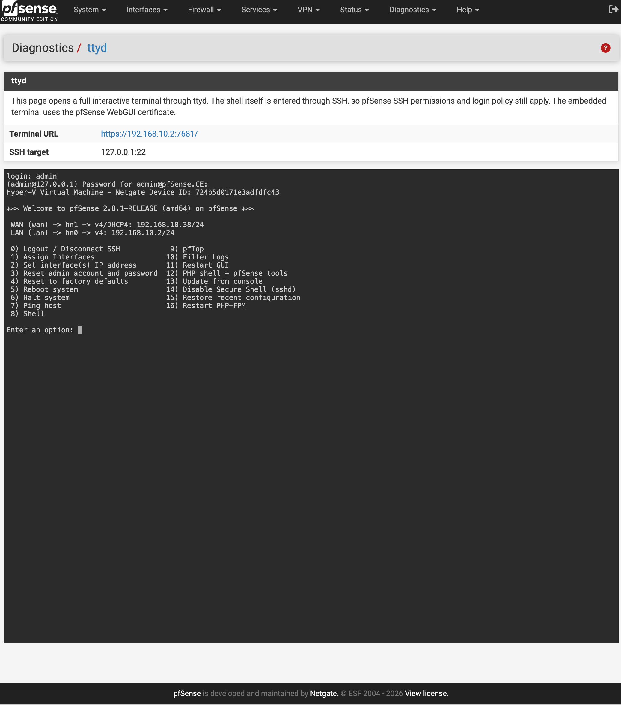

# ttyd for pfSense


[](https://www.pfsense.org/)
[](https://www.freebsd.org/)
[](https://github.com/tsl0922/ttyd)
[](https://github.com/Opnwall/ttyd-for-pfSense/blob/main/LICENSE)

This package adds a ttyd browser terminal to the pfSense web interface under:

```text
Diagnostics > ttyd
```

The web terminal does not execute commands through PHP. It starts a real TTY through `ttyd`, then prompts for a login name and runs SSH to the local firewall:

```sh
printf "login: "; read -r user; ssh -tt "$user@127.0.0.1"
```

Authentication, permissions, auditing, and the shell environment remain controlled by OPNsense OpenSSH. 

Tested and verified in the following environments:

- pfSense CE 2.8.1
- pfSense plus 26.03



## Compatibility

The installer includes offline ttyd runtimes for:

- pfSense CE based on FreeBSD 15
- pfSense Plus based on FreeBSD 16

At install time it detects the FreeBSD major version and copies the matching runtime from:

```text
src/usr/local/share/ttyd-for-pfsense/freebsd15.tar.gz
src/usr/local/share/ttyd-for-pfsense/freebsd16.tar.gz
```

If no bundled runtime matches the host, the installer falls back to the pfSense package repository and then to compatible FreeBSD packages when possible.

The bundled runtime is installed under:

```text
/usr/local/pfSense-pkg-ttyd
```

This keeps ttyd and its bundled libraries separate from pfSense system packages.

## Files

- `src/usr/local/www/diag_ttyd.php`: pfSense web page.
- `src/usr/local/pkg/ttyd.inc`: package callbacks and service sync logic.
- `src/usr/local/pkg/ttyd.xml`: pfSense package GUI registration.
- `src/usr/local/share/pfSense-pkg-ttyd/info.xml`: package metadata.
- `src/usr/local/share/ttyd-for-pfsense/freebsd15.tar.gz`: offline FreeBSD 15 runtime.
- `src/usr/local/share/ttyd-for-pfsense/freebsd16.tar.gz`: offline FreeBSD 16 runtime.
- `src/usr/local/etc/rc.d/ttyd`: rc.d service script.
- `src/etc/rc.conf.d/ttyd`: default service configuration.
- `build.sh`: creates a FreeBSD pkg package.

## Install

From an pfSense shell, enter this project directory and run:

```sh
pkg add -f os-ttyd.pkg
```

Refresh the pfSense web interface and open `Diagnostics > ttyd`.

## Uninstall

```sh
pkg delete os-ttyd
```

## Requirements

1. Enable Secure Shell under `System > Advanced > Admin Access`.
2. Allow the management workstation to reach the ttyd HTTPS/WebSocket port. The default port is `7681`.
3. Bind ttyd to a trusted management/LAN address when possible. Do not expose it to WAN.

## Usage

Open `Diagnostics > ttyd` or browse directly to:

```text
https://<pfSense-address>:7681/
```

The terminal first displays `login:`. Enter the pfSense SSH username, then enter the SSH password or key passphrase when prompted. After login, pfSense displays its console menu.

The service uses the pfSense WebGUI certificate from the generated WebConfigurator nginx configuration, falling back to `/var/etc/cert.crt` and `/var/etc/cert.key`. It does not generate its own HTTPS certificate.

## Security Notes

- Do not expose the ttyd listener to WAN.
- Use strong pfSense administrator credentials or SSH keys.
- Remove the package or restrict management access when the terminal is not needed.

## Disclaimer
This is an unofficial plugin and is not supported by the pfSense team; use at your own risk.
